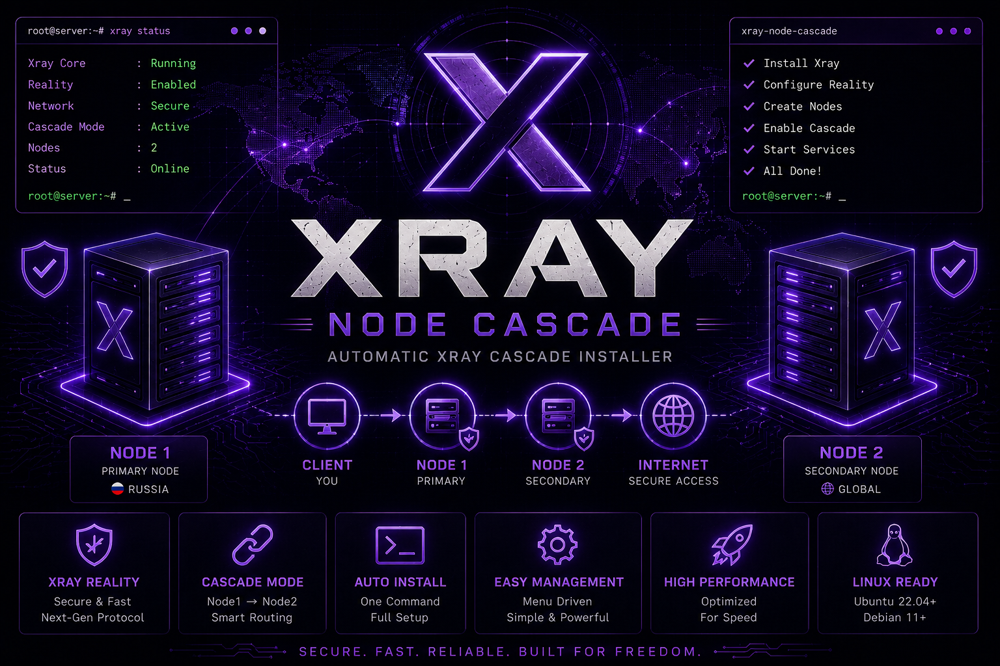

# Xray Cascade Manager v1.0

<p align="center">
  
</p>

<h1 align="center">
Xray Cascade Manager
</h1>

Менеджер двухсерверного каскада Xray:

```text
Client / Phone / PC
   ↓ VLESS Reality :443
RU Gateway VPS
   ↓ HTTP CONNECT
Exit VPS
   ↓
Internet
```

## Возможности

- RU/EN меню
- установка Gateway сервера
- установка Exit сервера
- VLESS Reality вход на 443
- HTTP CONNECT между Gateway и Exit
- выбор SNI
- генерация UUID, x25519 ключей и shortId
- QR-код
- VLESS-ссылка
- простая подписка на порту `2096`
- статус и рестарт Xray

## Установка

### Быстрая установка (рекомендуется)

```bash
bash <(curl -Ls https://raw.githubusercontent.com/vladislove1337-sfc/xray-node-cascade/main/install.sh)
```

После установки:

```bash
xcascade
```

---

### Ручная установка

```bash
git clone https://github.com/vladislove1337-sfc/xray-node-cascade.git

cd xray-node-cascade

chmod +x install.sh xcascade.sh

./install.sh
```

После установки:

```bash
xcascade
```

## Как ставить

### 1. На Exit VPS

Запусти:

```bash
xcascade
```

Выбери:

```text
Install Exit Server
```

По умолчанию:

```text
port: 10808
user: ru
pass: SwedenCascade1337
```

### 2. На RU Gateway VPS

Запусти:

```bash
xcascade
```

Выбери:

```text
Install Gateway Server
```

Укажи IP Exit VPS, порт, логин и пароль.

После установки скрипт покажет VLESS Reality ссылку и QR-code.

## Подписка

На Gateway VPS выбери:

```text
Start subscription
```

Ссылка будет вида:

```text
http://GATEWAY_IP:2096/sub
```

## Безопасность

На Exit VPS желательно закрыть порт HTTP proxy от всех, кроме RU Gateway.

Пример для UFW:

```bash
ufw allow ssh
ufw allow from RU_GATEWAY_IP to any port 10808 proto tcp
ufw deny 10808/tcp
ufw enable
```

## Примечание

Базовая рабочая схема v1.0 использует:

```text
VLESS Reality → HTTP CONNECT
```

Reality используется только на публичном входе Gateway. Между VPS используется HTTP CONNECT, потому что в тестах он стабильнее для Telegram и массовых TCP-соединений, чем SOCKS и Reality→Reality.
